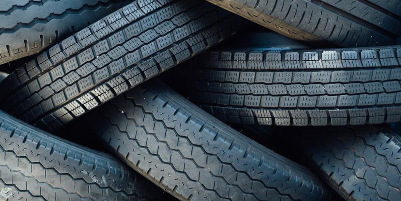

# TIRE PREDICTION  
  
## About
 

This project investigated tire conditions using ResNet and DenseNet (1) classify tire conditions based on texture cracked or normal; (2) predicting flat tires, full tires, or non-tires.

## Dataset 

* This experimentation adopted two public datasets, the first one titled Oxidized and non-oxidized tire sidewall and tread images [https://doi.org/10.7910/DVN/Z3ZYLI]. The second dataset is flat tire from the Kaggle dataset [https://www.kaggle.com/datasets/rhammell/full-vs-flat-tire-images]. 

## Results
  

This experimentation using six architectures: ResNet50, ResNet101, ResNet152, DenseNet121, DenseNet169, DenseNet201. DenseNet121 model produced the best performance for the first dataset with 95% accuracy, while ResNet152 achieved 97% accuracy for remaining datasets.
